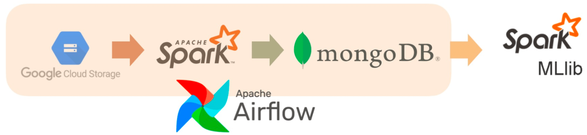
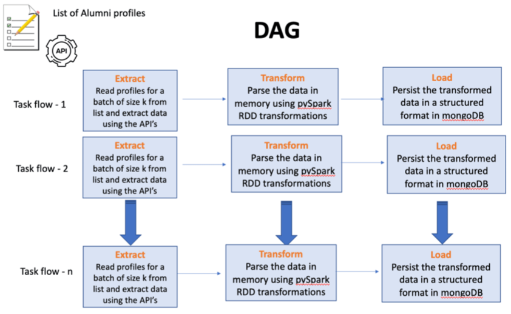

# Alumni Profile Matching

Alumni Profile Matching is a project aimed at facilitating networking between graduate students and alumni who share similar academic backgrounds and career goals. By developing a sophisticated machine learning model and data processing pipeline, the project enables students to connect with relevant alumni, seek mentorship support, and potentially secure referrals in companies where alumni are currently or previously associated.

## Problem/Motivation
Students often have limited opportunities to connect with alumni, typically during university meetups and fireside chats that offer brief interactions. Additionally, the career trajectories of alumni may differ significantly from those of current students, making their advice less relevant due to the disparity in backgrounds. The objective of this project is to bridge this gap by effectively matching current students with alumni profiles that exhibit significant similarities.

## Dataset & Analytics Goals
The project utilizes two primary data sources:

1. List of alumni profiles for each cohort: A comprehensive list of alumni from all previous cohorts of the graduate program is obtained. This data is stored in a dedicated Google Cloud Platform (GCP) storage bucket.

2. Scraped LinkedIn profiles data: LinkedIn profiles of alumni are scraped using the RapidAPI interface and integrated with LinkedIn's developer APIs. This enhances the richness and diversity of the dataset.

The analytics goals of the project include:
- Pre-processing and Feature Engineering: Applying techniques to enhance data quality, followed by feature engineering to derive meaningful features from the dataset.
- BERT Embedding: Utilizing BERT embedding techniques to vectorize user profiles and extract high-quality numerical representations of the textual data.
- GloVe Embedding: Employing GloVe embedding to identify the top 5 similar profiles and comparing the results with the BERT model. This comparative analysis assesses the effectiveness of different embedding approaches.
- TF-IDF: Performing TF-IDF (Term Frequency-Inverse Document Frequency) on the transformed data to calculate the significance of words within each profile and across the dataset. This aids in identifying key terms and patterns contributing to profile similarity.

## Data Engineering Pipeline

The data engineering pipeline involves three main steps:

1. Data Ingestion: This step includes data extraction, transformation, and loading. The data extraction task retrieves alumni profiles and scraped LinkedIn data, which are then stored in JSON format in the GCP storage bucket. The data is transformed and loaded into MongoDB using PySpark for data cleaning, flattening, and aggregation.

2. Data Storage: The organized and aggregated data is loaded into a data lake using an Extract-Transform-Load (ETL) pipeline implemented with Apache Airflow DAG Scheduler. This automates the data extraction, transformation, and loading process, ensuring efficiency and integrity.

3. Data Cleaning and Preprocessing: Missing data and inconsistency issues within the crawled profile data are addressed during the data cleaning process. Feature engineering techniques are applied to derive meaningful features, and exploratory data analysis is performed to gain insights into the dataset.

## Machine Learning Goal and Approaches
The machine learning goal is to identify the top 5 alumni profiles that closely align with a given input profile based on academic and professional background similarities. Several approaches are explored:

1. BERT Embeddings: SparkNLP library is utilized to generate BERT embeddings for text sequence data. Cosine similarity is computed between the embedding vectors to quantify profile similarity.

2. GloVe Embeddings: GloVe sequence embeddings are generated to capture word embeddings with contextual information. Cosine similarity is computed between the embeddings to identify similar profiles.

3. TF-IDF Vectorizer: The widely used TF-IDF method is employed to generate a mapping of sequences to vectors. Spark MLlib library is used to construct a pipeline that transforms textual information into numerical vectors using TF-IDF.

## Execution Times
The execution times for the different approaches on a dataset of approximately 500 alumni records using an I3.xlarge Databricks cluster are as follows:

- Bert Embedding: Command took 2.09 minutes
- Cosine Similarities: Command took 0.39 seconds
- TF-IDF: Command took 3.43 seconds
- GloVe Embeddings: Command took 12.97 seconds
- TF-IDF after Feature Engineering (Encodings & Geographical Distance): Command took 5.07 seconds

These execution times provide insights into the efficiency and speed of the different approaches used for embedding generation, similarity computation, and feature engineering.

## Machine Learning Outcome
After manual comparison, it was determined that the TF-IDF approach, combined with considering geographical distance, yielded the most favorable outcomes. This approach demonstrated superior performance in suggesting the top 5 similar profiles for a given input profile.

## Conclusion
The Alumni Profile Matching project successfully developed a data processing pipeline that matches students with alumni who share similar backgrounds and career goals. By leveraging machine learning techniques, the pipeline recommends the top 5 alumni profiles based on academic and professional background similarities, facilitating networking and providing students with valuable career advice and guidance.

## License
This project is licensed under the [MIT License](LICENSE).
